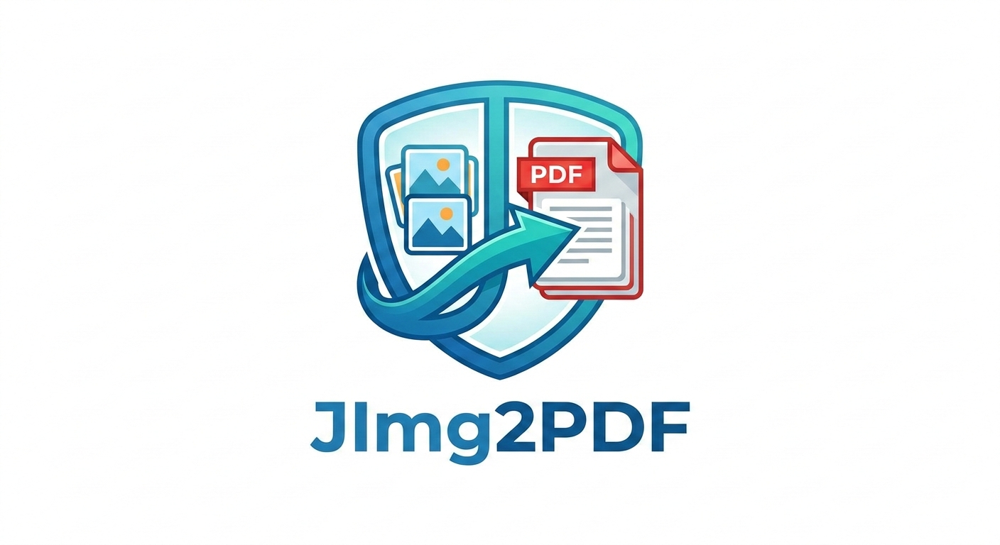

# JImg2PDF


A simple Java utility to convert multiple images into a single PDF file.

## Features

- Convert multiple images (JPG, PNG, BMP, GIF, TIFF) into a single PDF
- Preserves original image quality and dimensions
- Simple command-line interface
- Lightweight and fast

## Requirements

- Java 11 or higher
- Maven or Gradle (for building from source)

## Building from Source

```bash
# Clone the repository
git clone https://github.com/yourusername/JImg2PDF.git
cd JImg2PDF

# Build the JAR file
./gradlew build

# The JAR will be available at: build/libs/JImg2PDF-1.0-SNAPSHOT.jar
```

## Usage

```
java -jar JImg2PDF.jar <output.pdf> <image1> [<image2> ...]
```

### Examples

Convert multiple images to a single PDF:
```bash
java -jar JImg2PDF.jar output.pdf image1.jpg image2.png image3.bmp
```

Convert all images in a directory (on Unix-like systems):
```bash
java -jar JImg2PDF.jar output.pdf images/*
```

## Screenshots

### Main Application Window


### Image Preview and Selection


## Supported Image Formats

- JPEG (.jpg, .jpeg)
- PNG (.png)
- BMP (.bmp)
- GIF (.gif)
- TIFF (.tif, .tiff)

## License

This project is licensed under the MIT License - see the [LICENSE](LICENSE) file for details.
